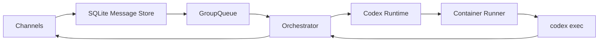

# Technical Architecture

## Overview

This repository now follows the NanoClaw host model more closely:

The host remains responsible for:

- channel registration
- message persistence
- group registration
- per-group concurrency control
- scheduler dispatch
- remote-control and control-channel behavior

The Codex-specific divergence is limited to:

- OpenAI Codex login and token refresh
- provider auth storage in `provider_auth`
- container-side auth material generation
- `codex exec` request assembly

## Core Files

- `src/index.ts`
  CLI entrypoint. `serve` now boots the NanoClaw-style orchestrator.
- `src/orchestrator.ts`
  Main runtime loop. Connects channels, stores messages, restores router state, and drains per-group execution through `GroupQueue`.
- `src/db.ts`
  Host-level SQLite store for chats, messages, router state, sessions, scheduled tasks, provider auth, and transcript events.
- `src/group-queue.ts`
  Per-group queue with global concurrency limits and idle handling.
- `src/task-scheduler.ts`
  Scheduler loop for once, interval, and cron tasks.
- `src/router.ts`
  Formatting and outbound routing helpers.
- `src/runtime/codex/codex-runtime.ts`
  Codex runtime adapter.
- `src/runner/container-runner.ts`
  Container spawn and IPC bridge.

## Runtime Shape

The host is intentionally message-driven:

1. A channel receives a message.
2. Chat metadata and the message are stored in `src/db.ts`.
3. The group JID is enqueued in `GroupQueue`.
4. The orchestrator drains pending messages for that group.
5. The Codex runtime creates or resumes the group session.
6. The container runner executes `codex exec`.
7. Outbound text is routed back through the owning channel.

## Session Model

- Group-level session continuity is preserved.
- Root router state stores `last_timestamp` and `last_agent_timestamp`.
- Runtime session reuse remains backed by the Codex runtime session hint path.

## Scheduler Model

- Scheduled tasks are stored in `scheduled_tasks`.
- The scheduler loop pushes tasks into the same `GroupQueue`.
- Scheduled work and normal chat work therefore share group execution semantics.

## Development Channels

`local-dev` and `main-local` remain built-in for testing and smoke validation. They are development channels, not product channels.

Future Web, Slack, Telegram, or Feishu support should be added as separate forks built on top of this core.
